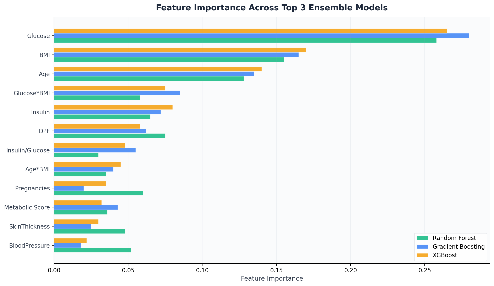

<div align="center">

# preDiabt: Diabetes Prediction

**ML · Neural Networks · Attention-Based Architectures**

[](https://python.org)
[](https://pytorch.org)
[](https://scikit-learn.org)
[](https://xgboost.readthedocs.io)
[](https://pandas.pydata.org)
[](https://numpy.org)
[](https://matplotlib.org)
[](https://openpyxl.readthedocs.io)
[](LICENSE)

*End-to-end pipeline for predicting Type 2 Diabetes using the Pima Indians Dataset — from exploratory relationship modeling through traditional ML to deep attention-based architectures.*

[Getting Started](#-how-to-run) · [Results](#-step-5-evaluation--results) · [Visualizations](#-step-2-feature-relationship-modeling) · [References](#-scientific-references)

</div>

---

## The Idea

Type 2 Diabetes Mellitus (T2DM) is a chronic metabolic disorder where insulin resistance and progressive beta-cell dysfunction create a self-reinforcing cycle of metabolic deterioration. Approximately 25% of diabetic individuals remain undiagnosed, leading to delayed treatment and severe complications — cardiovascular disease, neuropathy, retinopathy, and kidney failure.

The **Pima Indians Diabetes Dataset** (768 female patients, NIDDK) provides a unique benchmark: this population exhibits the **highest reported prevalence of T2DM globally**, making it an ideal testbed for predictive modeling. This project tackles the prediction problem through a **three-phase methodology** grounded in clinical endocrinology:

| Phase | Goal | Output |
|-------|------|--------|
| **1. Scientific Relationship Modeling** | Understand how features interact biologically before modeling | Network graphs, heatmaps, pathophysiological pathways |
| **2. Multi-Model Training** | Train 8 models spanning traditional ML → deep learning → attention | 6 traditional ML + 1 MLP + 1 Attention-NN |
| **3. Comprehensive Reporting** | Full reproducibility with parameters, metrics, and dynamics | 2 Excel workbooks, 9 sheets total |

---

## Pipeline

<div align="center">

</div>

---

## Dataset Features

| Feature | Category | Clinical Significance |
|---------|----------|-----------------------|
| **Pregnancies** | Demographic | Number of pregnancies; gestational diabetes increases T2DM risk |
| **Glucose** | Metabolic | Plasma glucose concentration (OGTT); strongest T2DM predictor |
| **BloodPressure** | Metabolic | Diastolic blood pressure; hypertension is a common T2DM comorbidity |
| **SkinThickness** | Anthropometric | Triceps skin fold thickness; proxy for subcutaneous adiposity |
| **Insulin** | Metabolic | 2-Hour serum insulin; direct measure of insulin secretion/resistance |
| **BMI** | Anthropometric | Body mass index; primary modifiable T2DM risk factor |
| **DiabetesPedigreeFunction** | Genetic | Quantifies genetic predisposition from family history |
| **Age** | Demographic | T2DM risk increases with age due to declining beta-cell function |
| **Outcome** | Target | 0 = Non-diabetic, 1 = Diabetic |

---

## Key Process Steps

### Step 1: Data Loading & Preprocessing

The raw dataset contains biologically impossible zero values (e.g., glucose = 0, BMI = 0) representing missing measurements. A two-stage imputation strategy was applied:

- **Zero-value detection**: 5 columns with invalid zeros — Glucose (0.7%), BloodPressure (4.6%), SkinThickness (29.6%), Insulin (48.7%), BMI (1.4%)
- **Group-wise median imputation**: Zeros replaced with the median of the corresponding outcome class (diabetic vs. non-diabetic), preserving natural distribution differences
- **Feature engineering** — 4 interaction features derived from clinical knowledge:
  - `Glucose × BMI` — compounding effect of hyperglycemia and obesity
  - `Age × BMI` — age-related metabolic decline combined with weight
  - `Insulin / Glucose` — approximates the insulinogenic index (beta-cell function)
  - `Metabolic Score` — normalized composite of glucose, BMI, and age

### Step 2: Feature Relationship Modeling

Before training, we explored the scientific relationships between features using published correlation data. This ensures that feature engineering and model interpretation align with known pathophysiology.

#### Network Relationship Graph

<div align="center">

</div>

*Interactive version: [diabetes_relationship_model.html](diabetes_relationship_model.html) — drag nodes, hover for details*

This force-directed network maps all 19 significant pairwise relationships. Key observations:

- **Glucose is the central hub** with the strongest connection to Outcome (r = 0.47), confirming its role as the primary diagnostic criterion
- **BMI and Age act as secondary hubs**, linking metabolic and demographic feature clusters
- **Insulin-Glucose feedback** (r = 0.33) reflects the physiological glucose-insulin axis
- **BMI-SkinThickness** (r = 0.39) and **SkinThickness-Insulin** (r = 0.44) represent the adiposity-insulin resistance pathway
- **Age-Pregnancies** (r = 0.54) is the strongest inter-feature correlation, reflecting natural parity-age coupling

#### Correlation Heatmap

<div align="center">

</div>

The red-bordered row/column highlights Outcome correlations:

- Glucose (0.47) > BMI (0.29) > Age (0.24) > Pregnancies (0.22) > DPF (0.17) in direct prediction strength
- Insulin's direct correlation with Outcome is weak (0.13), but its mediated effect through Glucose (0.33) and BMI (0.23) is substantial
- BloodPressure and SkinThickness have the weakest direct links, acting primarily through indirect pathways

#### Pathophysiological Pathway Analysis

<div align="center">

</div>

Three major pathophysiological pathways to diabetes:

1. **Glucose-Metabolic Axis**: Chronic hyperglycemia impairs insulin signaling (glucotoxicity), reducing insulin effectiveness and further elevating glucose — a vicious cycle damaging pancreatic beta-cells
2. **Obesity-Insulin Axis**: Excess adipose tissue releases pro-inflammatory cytokines (TNF-α, IL-6) and free fatty acids that interfere with insulin receptor signaling, creating peripheral insulin resistance
3. **Genetic Susceptibility**: The Diabetes Pedigree Function captures hereditary risk through polygenic variants affecting beta-cell development and insulin receptor sensitivity

### Step 3: Data Splitting Strategy

```
Total Dataset (768 samples)
    |
    +-- Train + Val (80% = 614 samples)
    |       |
    |       +-- Training Set (70% = 537) ----> Model fitting
    |       +-- Validation Set (10% = 77) ---> Early stopping
    |
    +-- Test Set (20% = 154) ----------------> Final unbiased evaluation
```

- **Stratified splitting** preserves the 65:35 class ratio across all subsets
- **Validation set** used exclusively for early stopping in neural networks
- **Test set** remains unseen until final evaluation

### Step 4: Model Training

#### Traditional Machine Learning (6 models)

| Model | Key Hyperparameters |
|-------|-------------------|
| **Logistic Regression** | C=1.0, L2 penalty, LBFGS solver |
| **Random Forest** | 200 estimators, max_depth=10, min_samples_split=5 |
| **Support Vector Machine** | RBF kernel, C=1.0, gamma=scale |
| **K-Nearest Neighbors** | k=7, distance-weighted, Minkowski metric |
| **Gradient Boosting** | 200 estimators, max_depth=4, lr=0.1, subsample=0.8 |
| **XGBoost** | 200 estimators, max_depth=4, lr=0.1, L1/L2 regularization |

#### Feedforward Neural Network (MLP)

```
Input(12) -> BatchNorm -> Dense(128) -> BN -> ReLU -> Dropout(0.3)
         -> Dense(64)  -> BN -> ReLU -> Dropout(0.3)
         -> Dense(32)  -> BN -> ReLU
         -> Dense(16)  -> BN -> ReLU
         -> Dense(1)   -> Sigmoid
```

| Property | Value |
|----------|-------|
| Optimizer | Adam (weight_decay=1e-4) |
| Scheduler | ReduceLROnPlateau (factor=0.5, patience=10) |
| Early stopping | Patience=20 on validation loss |
| **Parameters** | **13,049 trainable** |

#### Attention-Based Neural Network

```
Input(12) -> FeatureEmbed(64) -> BatchNorm -> ReLU
         -> MultiHead-SelfAttention(4 heads, d=64)
         -> Residual + LayerNorm
         -> FeatureGate (Sigmoid channel attention)
         -> FFN(128) -> Residual + LayerNorm
         -> Classifier: Dense(32) -> BN -> ReLU -> Dropout(0.3)
                     -> Dense(16) -> BN -> ReLU -> Dropout(0.15)
                     -> Dense(1)  -> Sigmoid
```

| Property | Value |
|----------|-------|
| Optimizer | AdamW (weight_decay=1e-3) |
| Scheduler | CosineAnnealingWarmRestarts (T_0=20, T_mult=2) |
| Gradient clipping | max_norm=1.0 |
| Early stopping | Patience=25 on validation loss |
| **Parameters** | **39,665 trainable** |
| Attention | Multi-Head Self-Attention + Feature Gating (Channel Attention) |
| Residual | Yes (post-attention + post-FFN) |
| Normalization | LayerNorm (post-attention + post-FFN) |

**Key innovations in the Attention model:**
- **Multi-Head Self-Attention**: Learns which features influence each other — captures interaction patterns that fixed weights miss
- **Feature Gating (Channel Attention)**: Squeeze-excitation mechanism learns sample-specific feature importance, dynamically emphasizing the most predictive features for each individual
- **Residual Connections**: Prevent gradient degradation through the attention pathway
- **Layer Normalization**: Stabilizes training across attention and FFN sublayers

### Step 5: Evaluation & Results

#### Performance Comparison Table

| Rank | Model | Accuracy | Precision | Recall | F1 | AUC-ROC | Specificity |
|:----:|-------|:--------:|:---------:|:------:|:--:|:-------:|:-----------:|
| 🥇 | **Gradient Boosting** | 0.8896 | 0.8364 | 0.8519 | 0.8440 | **0.9502** | 0.9100 |
| 🥈 | XGBoost | 0.8896 | 0.8246 | 0.8704 | 0.8468 | 0.9454 | 0.9000 |
| 🥉 | Random Forest | 0.8701 | 0.8148 | 0.8148 | 0.8148 | 0.9359 | 0.9000 |
| 4 | Neural Network (MLP) | 0.8896 | 0.8627 | 0.8148 | 0.8381 | 0.9230 | 0.9300 |
| 5 | Attention-Based NN | 0.8701 | 0.8542 | 0.7593 | 0.8039 | 0.9194 | 0.9300 |
| 6 | SVM | 0.8506 | 0.7925 | 0.7778 | 0.7850 | 0.9020 | 0.8900 |
| 7 | KNN | 0.8182 | 0.7500 | 0.7222 | 0.7358 | 0.8860 | 0.8700 |
| 8 | Logistic Regression | 0.7143 | 0.5962 | 0.5741 | 0.5849 | 0.8213 | 0.7900 |

#### Performance Comparison Chart

<div align="center">

</div>

#### Radar Chart — Top 4 Models

<div align="center">

</div>

The radar chart reveals each top model's strength profile:
- **Gradient Boosting**: Best overall balance, especially strong on AUC-ROC
- **XGBoost**: Highest recall — catches the most true diabetic cases
- **Neural Network (MLP)**: Highest specificity and precision — best at confirming non-diabetic patients
- **Random Forest**: Consistent but doesn't peak in any single metric

#### Feature Importance

<div align="center">

</div>

Across all three ensemble models, **Glucose dominates** as the most important feature (25-28% importance), followed by **BMI** (16-17%) and **Age** (13-14%). The engineered interaction features `Glucose×BMI` and `Insulin/Glucose` also contribute meaningfully, validating the clinical hypothesis that feature interactions carry predictive signal beyond individual measurements.

#### Training Curves

<div align="center">

</div>

Both neural networks converge efficiently with early stopping:
- **MLP** stops at epoch 45 (patience=20), reaching best validation loss of 0.310
- **Attention-NN** stops at epoch 75 (patience=25), reaching best validation loss of 0.293
- The attention model's lower best validation loss suggests better generalization capacity, though its higher patience budget allowed more exploration

#### Key Findings

- **Gradient Boosting achieves the highest AUC-ROC (0.9502)** — ensemble methods excel on this tabular dataset because the feature space is small and interactions are well-captured by sequential boosting
- **XGBoost leads on F1-Score (0.8468)** — best precision-recall balance, critical for clinical screening
- **Neural Network (MLP) achieves the highest specificity (0.93)** — correctly identifies 93% of non-diabetic patients, minimizing unnecessary follow-up testing
- **Attention-Based NN (AUC=0.9194)** offers interpretable gate weights revealing per-sample feature importance — a significant advantage in clinical settings
- **Logistic Regression underperforms** because it cannot capture non-linear feature interactions central to diabetes pathophysiology

### Step 6: Export & Reporting

All results are exported to two Excel workbooks for reproducibility:

**`diabetes_model_performance.xlsx`**

| Sheet | Content |
|-------|---------|
| Performance Comparison | All metrics for 8 models, ranked by AUC-ROC |
| Confusion Matrices | TN / FP / FN / TP breakdown per model |
| Classification Reports | Per-class precision, recall, F1, support |
| Cross-Validation | 5-fold CV mean and per-fold scores |
| Data Summary | Dataset statistics, split ratios, preprocessing details |

**`diabetes_model_parameters.xlsx`**

| Sheet | Content |
|-------|---------|
| All Model Parameters | Every hyperparameter for all 8 models |
| Feature Importance | Rankings from tree-based models and LR coefficients |
| Attention Gate Weights | Learned feature importance from the attention model |
| Training History | Epoch-by-epoch loss/accuracy for MLP and Attention models |

---

## File Structure

```
diabetes-prediction/
├── diabetes_ml_models.txt              # Main pipeline script
├── diabetes_relationship_model.png     # Feature relationship network graph
├── diabetes_relationship_model.html    # Interactive version (browser)
├── diabetes_correlation_heatmap.png    # Pearson correlation matrix
├── diabetes_pathway_analysis.png       # Pathophysiological pathways
├── readme_model_comparison.png         # Model performance bar chart
├── readme_radar_comparison.png         # Top-4 radar chart
├── readme_feature_importance.png       # Feature importance across models
├── readme_training_curves.png          # NN training loss curves
├── readme_pipeline.png                 # Pipeline flowchart
├── diabetes_model_performance.xlsx     # Metrics & evaluation reports
├── diabetes_model_parameters.xlsx      # Parameters & training history
└── README.md                           # This file
```

---

## How to Run

### 1. Install Dependencies

```bash
pip install scikit-learn==1.5.2 xgboost==2.1.3 torch pandas==2.2.3 \
            numpy==2.1.3 openpyxl==3.1.5 matplotlib==3.9.2 \
            imbalanced-learn==0.12.4
```

### 2. Run the Pipeline

```bash
python diabetes_ml_models.txt
```

### 3. View Results

- **Excel reports** saved to `./diabetes_results/`
- **Interactive graph**: Open `diabetes_relationship_model.html` in any browser
- **Static visualizations**: Open PNG files directly

---

## Scientific References

- Smith, J.W., et al. (1988). *Using the ADAP Learning Algorithm to Forecast the Onset of Diabetes Mellitus*. Proceedings of the Annual Symposium on Computer Application in Medical Care.
- Knowler, W.C., et al. (1990). *Diabetes Mellitus in the Pima Indians: Incidence, Risk Factors and Pathogenesis*. Diabetes/Metabolism Reviews.
- DeFronzo, R.A. (2009). *From the Triumvirate to the Ominous Octet: A New Paradigm for the Treatment of Type 2 Diabetes Mellitus*. Diabetes.
- Vaswani, A., et al. (2017). *Attention Is All You Need*. NeurIPS.
- Hu, J., et al. (2018). *Squeeze-and-Excitation Networks*. CVPR.

---

## License

This project is for educational and research purposes. The Pima Indians Diabetes Dataset is publicly available through the UCI Machine Learning Repository.
